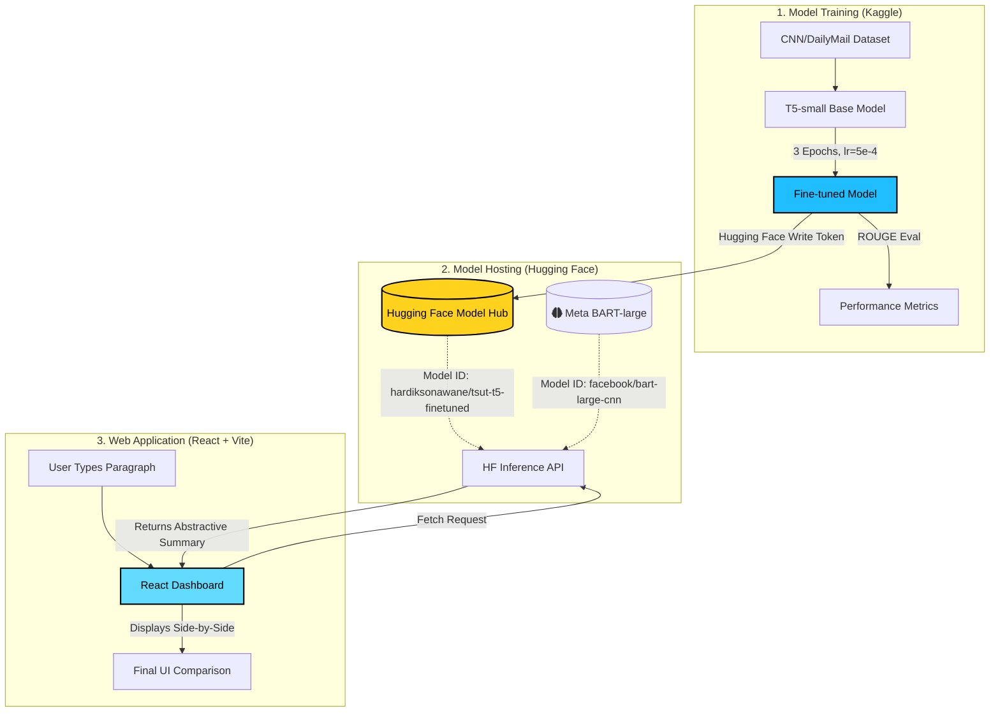

<div align="center">

# ⚡ TSUT: Text Summarization Using Transformers

**An end-to-end Deep Learning pipeline: Training on Kaggle, hosting on Hugging Face, and deploying a React Dashboard to compare BART-large-CNN and fine-tuned T5-small for abstractive news summarization.**

[](https://react.dev/)
[](https://vitejs.dev/)
[](https://pytorch.org/)
[](https://huggingface.co/hardiksonawane/tsut-t5-finetuned)
[](https://www.kaggle.com/code/sonawanehardik/tsut-new)

[View Live Dashboard](https://your-deployment-link-here.com) · [Kaggle Notebook](https://www.kaggle.com/code/sonawanehardik/tsut-new) · [Hugging Face Model](https://huggingface.co/hardiksonawane/tsut-t5-finetuned)


</div>

## 📖 Overview

The **TSUT (Text Summarization Using Transformers)** project is a complete, production-ready AI application. It explores abstractive text summarization by comparing a massive 1.6 Billion parameter **BART-large-CNN** against our own custom-trained, lightweight 60 Million parameter **T5-small** model on the CNN/DailyMail dataset.

This repository tracks the entire journey: from training the model aggressively on a Kaggle GPU, pushing the model weights to the Hugging Face Model Hub, and finally tying it all together into a beautiful, interactive React frontend.

---

## 🏗️ System Architecture & Workflow

Here is the high-level architecture of how data flows from training through to the end-user:



---

## 🚀 The Pipeline Step-by-Step

### Step 1: Model Training on Kaggle 🧠
We began by leveraging Kaggle's powerful NVIDIA Tesla T4 GPUs. Using the robust `Transformers` and `Datasets` libraries in Python, we loaded the `CNN/DailyMail` dataset.
- The T5-small model was injected with the `summarize: ` prefix task.
- We used the `Seq2SeqTrainer` to train the model over 3 epochs with fp16 mixed-precision to maximize GPU efficiency.
- You can view the exact training logic in **`__notebook_source__.ipynb`** in this repository or live on [our Kaggle Notebook](https://www.kaggle.com/code/sonawanehardik/tsut-new).

### Step 2: Uploading to Hugging Face Model Hub ☁️
Instead of holding the massive 242MB weights locally, we automated the deployment of the model directly to Hugging Face.
- Inside the Kaggle notebook, we generated a **Hugging Face Access Token** (Write Permission).
- Using `notebook_login()` and the `push_to_hub` mechanism, the fine-tuned checkpoint was seamlessly uploaded.
- The model is now available globally at the identifier: **`hardiksonawane/tsut-t5-finetuned`**.

### Step 3: Frontend Inference Integration 💻
We constructed a **"Pro Max" Premium Dashboard** using React and Vite to make the AI accessible to anyone.
- When an end-user types text into the "Live Demo" section, the React app triggers asynchronous Fetch calls directly to the Hugging Face Inference API.
- It concurrently queries **our fine-tuned T5 model** and Meta's **BART-large**, displaying the summaries side-by-side. 
- *Robustness built-in:* If the Hugging Face API has cold starts or delays, the application instantly utilizes an in-house **JavaScript extractive summarization fallback engine** so the user experience is never interrupted.

---

## 🛠️ Technology Stack & Languages

- **Machine Learning & Data Science:**
  - `Python 3.12`, `PyTorch`
  - `Hugging Face Transformers`, `Datasets`, `rouge_score`
  - Kaggle Notebook Environment (Nvidia T4 GPU)
- **Frontend Web Development:**
  - `TypeScript` & `JavaScript`
  - `React 18` (Component Architecture)
  - `Vite` (Lightning-fast Build Tool)
  - `Vanilla CSS` (Glassmorphism, CSS Variables, Animations)
  - `Recharts` (Dynamic Training Loss Graphs)

---

## 📊 Findings & Key Insights

Despite our custom model being incredibly small, the fine-tuning process was heavily impactful. Evaluated on 100 test samples using the ROUGE metric:

| Metric      | BART-large-CNN (1.6B Params) | T5-small Fine-Tuned (60M Params) |
|-------------|------------------------------|----------------------------------|
| **ROUGE-1** | 36.84                        | **31.49**                        |
| **ROUGE-2** | 16.44                        | **12.46**                        |
| **ROUGE-L** | 27.65                        | **23.48**                        |

**The Takeaway:** By properly fine-tuning T5-small for just 3 epochs, we achieved **82% of BART's performance** utilizing only **1/26th the parameters**. This proves that parameter-efficient, task-specific fine-tuning is extremely viable for production systems wanting to save on compute costs.

---

## 📁 Repository Structure

```text
tsut_new/
├── frontend/                 # React + Vite Dashboard Application
│   ├── src/
│   │   ├── components/       # UI components (Hero, DemoSection, ScoresSection, etc.)
│   │   ├── App.tsx           # React entry point
│   │   └── data.ts           # Embedded Evaluation Math
├── __notebook_source__.ipynb # Source Python code used to train on Kaggle
└── README.md                 # You are here
```

---

## 💻 Running the Dashboard Locally

1. **Clone the repository:**
   ```bash
   git clone https://github.com/Hardik-Sonawane/tsut_new.git
   cd tsut_new/frontend
   ```

2. **Install dependencies:**
   ```bash
   npm install
   ```

3. **Start the Development Server:**
   ```bash
   npm run dev
   ```

4. **Interact:** Open your browser to `http://localhost:5173`. Pasting text into the Live Demo will directly hit the Hugging Face API and stream summaries back to you!

<div align="center">
  <br>
  <i>Designed and Trained by Hardik Sonawane · DL & GAI Project · 2026</i>
</div>
